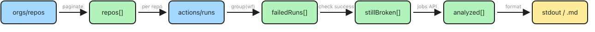

# Helper Scripts — GitHub

A collection of zero-dependency Node.js CLI utilities for managing GitHub Enterprise Server (GHES) repositories and secrets. All scripts require Node.js 18+ and `git`/`gh` on PATH.

---

## Scripts

| Script | Purpose | Docs |
|---|---|---|
| [clone-org-repos](clone-org-repos/) | Bulk clone all non-archived repos from a GHES org | [clone-org-repos.md](clone-org-repos/clone-org-repos.md) |
| [sync-repos](sync-repos/) | Keep local repos in sync with remote | [sync-repos.md](sync-repos/sync-repos.md) |
| [create-org-secret](create-org-secret/) | Set a GitHub org secret from a local env var | [create-org-secret.md](create-org-secret/create-org-secret.md) |
| [backfill-release-notes](backfill-release-notes/) | Retroactively generate release notes for GitHub releases | [backfill-release-notes.md](backfill-release-notes/backfill-release-notes.md) |
| [search-assigned-issues](search-assigned-issues/) | Search open issues assigned to a user across a GHES org | [search-assigned-issues.md](search-assigned-issues/search-assigned-issues.md) |
| [report-failed-workflows](report-failed-workflows/) | Report still-broken GitHub Actions workflows across an org | [report-failed-workflows.md](report-failed-workflows/report-failed-workflows.md) |
| [create-issue](create-issue/) | Create a GitHub issue from a markdown file | [create-issue.md](create-issue/create-issue.md) |

---

## 1. clone-org-repos.js — Bulk clone an org's repos

**Purpose:** Fetches all repositories from a GHES organization via the REST API and clones every non-archived repo to a local directory.

```bash
GHES_TOKEN=<pat> node clone-org-repos.js <ghes-host> <org> [clone-dir]
```

### Data flow


### Key logic

- **Pagination** — Loops through `/api/v3/orgs/{org}/repos` with `per_page=100`, incrementing `page` until an empty batch is returned. Handles orgs with any number of repos.
- **Archive filtering** — `allRepos.filter((r) => !r.archived)` removes archived repos before cloning.
- **Idempotency** — `fs.existsSync(repoDir)` skips repos that already exist on disk, making re-runs safe.
- **Auth via URL** — Embeds the token in the clone URL (`https://<token>@host/...`) so no interactive auth prompt is needed.
- **Error isolation** — Each clone is wrapped in try/catch; a single repo failure doesn't halt the entire run.

---

## 2. sync-repos.js — Keep local repos in sync with remote

**Purpose:** Iterates over all git repos in a directory, pulls the latest `main`/`master` from remote, and merges it into whatever branch is currently checked out — all without losing uncommitted work.

```bash
node sync-repos.js [repos-dir]
```

### Sync workflow per repo


### Key logic

- **Two-tier git helpers** — `git()` throws on failure (used when failure is unexpected), while `gitSafe()` returns a result object (used when failure is a valid outcome like a merge conflict).
- **Default branch detection** — Tries `main` first, falls back to `master` via `rev-parse --verify`. Skips repos where neither exists.
- **Stash management** — Uses `git stash push -u` (includes untracked files) with a labeled message. The `finally` block guarantees stash pop is always attempted, even if pull or merge fails.
- **Pull strategy** — Tries `--ff-only` first (safest). Falls back to `--rebase` if fast-forward isn't possible. Aborts and reports if both fail.
- **Non-destructive merge** — On conflict, immediately runs `merge --abort` so the branch is left exactly as it was.
- **Safety checkout** — A final check ensures the repo ends up on the original branch regardless of what happened.

### Result statuses

| Status | Meaning |
|---|---|
| `synced` | Default branch pulled and merged successfully |
| `skipped` | Not a git repo, no default branch, or unreadable |
| `pull-failed` | Could not pull the default branch from remote |
| `merge-conflict` | Default branch could not be merged cleanly (aborted) |
| `stash-conflict` | Stashed changes could not be re-applied (still in stash) |

---

## 3. create-org-secret.js — Set a GitHub org secret from a local env var

**Purpose:** Reads a value from a local environment variable and creates/updates a GitHub organization-level Actions secret via the `gh` CLI.

```bash
GH_HOST=github.tools.sap node create-org-secret.js <org> <secret-name> <env-var> [visibility] [repos]
```

### Data flow


### Key logic

- **Visibility modes** — Supports `private` (default), `all`, and `selected`. When `selected`, a comma-separated repo list is required.
- **GHES support** — If `GH_HOST` is set, it's forwarded into the child process environment so `gh` targets the correct instance. Without it, the script defaults to `github.com`.
- **Secure value passing** — The secret value is piped via stdin, never as a CLI argument. This prevents it from appearing in `ps` output or shell history.
- **Encryption** — Delegated to `gh`, which uses libsodium/NaCl sealed boxes as required by the GitHub API.

---

## 4. backfill-release-notes.js — Retroactively generate release notes

**Purpose:** Finds GitHub releases with empty bodies, generates structured release notes via the GitHub API, and updates them. Excludes releases matching a configurable tag prefix (default: `helm-`).

```bash
GH_HOST=github.tools.sap node backfill-release-notes.js <owner/repo> [--apply] [--exclude-prefix=helm-]
```

### Data flow


### Key logic

- **Tag filtering** — `r.tag_name.startsWith(excludePrefix)` removes helm-chart and similar releases before processing.
- **Chronological ordering** — Releases are sorted by `created_at` to correctly identify each release's predecessor for the generate-notes API.
- **Dry-run by default** — Previews what would be updated. The `--apply` flag is required to actually modify releases, preventing accidental changes.
- **Auto-generated notes** — Uses `POST /repos/{owner}/{repo}/releases/generate-notes` with `tag_name` and `previous_tag_name` to produce notes with PR links and author attribution.
- **Secure body passing** — The release notes body is piped via stdin using `--input -` to avoid shell escaping issues with markdown content.
- **Error isolation** — Each release update is wrapped in try/catch; a single failure doesn't halt the entire run.

---

## 5. search-assigned-issues.js — Search open issues across an org

**Purpose:** Searches for open issues assigned to a user across all repositories in a GitHub organization, filtering out issues labeled as done, completed, or archived.

```bash
GH_HOST=github.tools.sap node search-assigned-issues.js <org> [assignee] [--exclude-label=done,completed,archived] [--output]
```

### Data flow


### Key logic

- **Search API** — Uses `GET /search/issues` with query `org:<org> assignee:<user> is:issue state:open -label:<excluded>` to find matching issues across all repos in a single call.
- **Auto-detect user** — If no assignee is provided, resolves the current `gh` user via `gh api user`.
- **Label exclusion** — Excludes issues with configurable labels (default: `done`, `completed`, `archived`). Archived repos are excluded automatically by the search API.
- **Grouped output** — Results are grouped by repository and sorted by repo name then issue number for easy scanning.
- **Markdown export** — `--output` writes results to a `.md` file with clickable issue links, dates, and labels for personal tracking.

---

## 6. report-failed-workflows.js — Report still-broken CI/CD workflows

**Purpose:** Scans all repos in a GitHub org for failed Actions workflow runs within a lookback window, filters out workflows that have since recovered (newer successful run), and writes a markdown report with failure analysis.

```bash
GH_HOST=github.tools.sap node report-failed-workflows.js <org> [--hours=24] [--output=failed-workflows.md]
```

### Data flow



### Key logic

- **Lookback window** — Queries `repos/{repo}/actions/runs?status=failure&created=>={since}` where `since` is computed from `--hours` (default 24). Manual pagination handles the nested `{ workflow_runs: [] }` response.
- **Still-broken filter** — Groups failures by workflow file path, picks the most recent failure per workflow, then checks `repos/{repo}/actions/workflows/{id}/runs?status=success&per_page=1` to see if a newer success exists. Only workflows with no newer success are reported.
- **Failure analysis** — Fetches job details via the Jobs API, extracts failed job and step names to produce a short analysis like `Job "build" failed at step "Run tests"`.
- **GHES support** — Uses `GH_HOST` environment variable, consistent with other scripts. Works on both GHES and github.com.
- **Error isolation** — Per-repo try/catch ensures one broken or Actions-disabled repo doesn't halt the scan. Skipped repos are logged and counted in the summary.

---

## 7. create-issue.js — Create a GitHub issue from a markdown file

**Purpose:** Reads a `.md` file, extracts the first `# Heading` as the issue title and the rest as the body, then creates a GitHub issue. Dry-run by default.

```bash
GH_HOST=github.tools.sap node create-issue.js <org> <repo> --source=issue.md [--assignee=user] [--label=bug,urgent] [--apply]
```

### Data flow


### Key logic

- **Markdown parsing** — The first `# Heading` line becomes the issue title; everything after becomes the body. An error is raised if no heading is found.
- **Dry-run by default** — Previews the issue (title, body, labels, assignee) without creating it. The `--apply` flag is required to actually create the issue, preventing accidental submissions.
- **Template included** — A `template.md` file provides a starting point with Description, Steps to Reproduce, Expected/Actual Behavior sections.
- **Label support** — `--label=bug,urgent` attaches comma-separated labels to the issue.
- **Auto-assignee** — Defaults to the current `gh` user via `GET /user` if `--assignee` is omitted.
- **Secure body passing** — The issue body is piped via stdin using `-F body=@-` to avoid shell escaping issues with markdown content.
- **GHES support** — Uses `GH_HOST` environment variable, consistent with other scripts.

---

## Cross-cutting patterns

| Pattern | Detail |
|---|---|
| **Zero dependencies** | Only Node.js built-ins (`child_process`, `fs`, `path`) + `fetch` (Node 18+) |
| **Env vars for secrets** | PATs/tokens are always read from environment, never from CLI args |
| **Idempotent** | Safe to re-run — clone skips existing dirs, sync stashes/restores, secret set is an upsert |
| **Graceful failure** | Individual item failures don't halt the batch; summaries report what needs attention |
| **GHES-first** | Designed for GitHub Enterprise Server with `github.com` as a fallback |

---

## Related

- [helper-scripts-k8s](https://github.tools.sap/I340602/helper-scripts-k8s) — Kubernetes cluster diagnostics and bulk operations (Bash)
