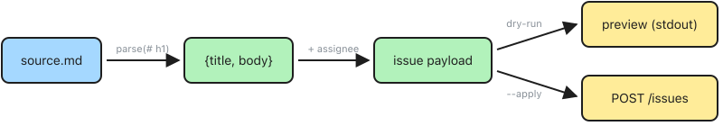

# create-issue.js

A Node.js helper script that creates a GitHub issue from a markdown file. The first `# Heading` becomes the issue title, and the rest of the file becomes the body.

## Features

- **Markdown-driven** — write your issue in a `.md` file, the script extracts title and body automatically.
- **Dry-run by default** — previews the issue without creating it. Pass `--apply` to actually create.
- **Template included** — copy `template.md` as a starting point for your issue.
- **Label support** — attach labels via `--label=bug,urgent`.
- **Auto-assignee** — defaults to the current `gh` user if `--assignee` is omitted.
- **GHES support** — set `GH_HOST` to target a GitHub Enterprise Server instance.
- **Secure body passing** — issue body is piped via stdin to avoid shell escaping issues.

## Prerequisites

| Requirement | Details |
|---|---|
| **Node.js** | v18 or later |
| **GitHub CLI (`gh`)** | Must be installed and authenticated (`gh auth login`). Token needs `repo` scope. |

## Usage

```bash
node create-issue.js <org> <repo> --source=FILE [--assignee=USER] [--label=LABELS] [--apply]
```

| Argument | Required | Description |
|---|---|---|
| `org` | Yes | GitHub organization name |
| `repo` | Yes | Repository name |
| `--source` | Yes | Path to `.md` file with issue content |
| `--assignee` | No | GitHub username to assign (default: current `gh` user) |
| `--label` | No | Comma-separated labels (e.g. `bug,urgent`) |
| `--apply` | No | Actually create the issue (default: dry-run preview) |

### Environment variables

| Variable | Required | Description |
|---|---|---|
| `GH_HOST` | For GHES | GHES hostname (e.g. `github.tools.sap`). Omit for `github.com`. |

## Template

A [template.md](template.md) file is included as a starting point. Copy it, fill in the sections, then pass it to the script:

```bash
cp create-issue/template.md my-issue.md
# Edit my-issue.md with your issue details
node create-issue/create-issue.js my-org my-repo --source=my-issue.md
```

### Template structure

```markdown
# Issue title here

## Description

What is the problem or feature request?

## Steps to reproduce

1. Step one
2. Step two

## Expected behavior

What should happen?

## Actual behavior

What happens instead?

## Additional context

Any relevant logs, screenshots, or links.
```

The only required element is the `# Title` heading — all other sections are optional.

## Examples

Preview an issue (dry-run):

```bash
GH_HOST=github.tools.sap node create-issue.js cs-devops my-repo --source=my-issue.md
```

Create the issue:

```bash
GH_HOST=github.tools.sap node create-issue.js cs-devops my-repo --source=my-issue.md --apply
```

Create with labels and a specific assignee:

```bash
GH_HOST=github.tools.sap node create-issue.js cs-devops my-repo --source=my-issue.md --assignee=I340602 --label=bug,priority-high --apply
```

Create an issue on github.com:

```bash
node create-issue.js my-org my-repo --source=my-issue.md --apply
```

### Sample dry-run output

```
Organization:  cs-devops (github.tools.sap)
Repository:    cs-devops/my-repo
Source:        /Users/I340602/my-issue.md

--- Issue Preview ---

  Repository:  cs-devops/my-repo (github.tools.sap)
  Title:       Fix broken pipeline for helm-charts
  Assignee:    I340602
  Labels:      bug, priority-high

  Body:
    ## Description
    
    The CI pipeline for helm-charts has been failing since the last Terraform upgrade.
    
    ## Steps to reproduce
    
    1. Push any change to the `main` branch
    2. Observe the "Validate" workflow fails at the "Terraform Plan" step
    
    ## Expected behavior
    
    The workflow should complete successfully.
    
    ## Actual behavior
    
    Fails with: `Error: Unsupported Terraform Core version`.

Pass --apply to create this issue.
```

### Sample creation output

```
Organization:  cs-devops (github.tools.sap)
Repository:    cs-devops/my-repo
Source:        /Users/I340602/my-issue.md

Creating issue...

  Issue created: #42
  URL:           https://github.tools.sap/cs-devops/my-repo/issues/42
```

## Data flow



## How it works

1. Reads the markdown file specified by `--source`.
2. Extracts the first `# Heading` as the issue title, everything after as the body.
3. In dry-run mode (default), prints a preview of the issue to be created.
4. With `--apply`, creates the issue via `POST /repos/{owner}/{repo}/issues` using `gh api`, piping the body via stdin.
5. Prints the created issue number and URL.

## API endpoints used

| Endpoint | Purpose |
|---|---|
| `GET /user` | Auto-detect current GitHub user for assignee |
| `POST /repos/{owner}/{repo}/issues` | Create the issue |
